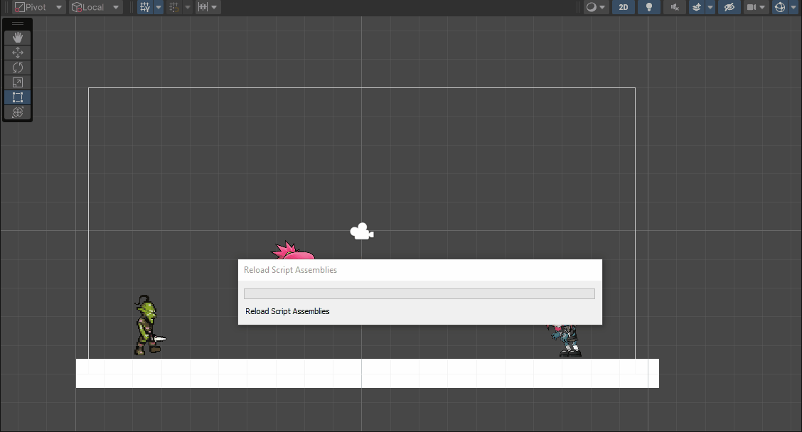

# Introducción a Unity 2D - Sprites.
## Autor: Álvaro González Rodríguez
alu0101202556

1. Crear una carpeta Sprites y dentro una carpeta Zombies y otra Goblin. Importar las imágenes como los nuevos assets en el proyecto. Las animaciones de cada zombie puede estar organizadas en subcarpetas.

Las carpetas se encuentran dentro del fichero Assets. Donde en Zombie cada acción esta dividida en una subcarpeta

2. Movimiento y salto del personaje Zombie.

Para el movimiento en el eje X se comprueba si se esta pulsando las teclas del teclado correspondientes al movimiento horizontal, si ese
es el caso se da una fuerza al rigidbody2d.

Para el salto se realiza lo mismo que en el movimiento en el eje X pero esta vez para el eje Y, aunque en esta ocasión se tienen que añadir nuevas variables
para evitar que el jugador pueda saltar las veces que quiera en el aire o que pueda saltar hasta el infinito. Las variables maxHeight y jumpMax se utiliza para añadir una altura
máxima al salto del jugador, donde jumpMax se actualiza en cada Update para tener una altura máxima relativa a su posición actual en el mundo y maxHeight es un booleano
que se iguala a true cuando se supera la distancia máxima de salto. Cuando se llega a esta situación el jugador ya no podrá seguir pulsando la tecla de saltar.

Se ha añadido la variable jumpTemp para evitar que el jugador pueda saltar otra vez en el aire. Esta es igual a 0 si el jugador no ha saltado y una vez salta se actualiza constantemente
con el valor del movimiento vertical, es decir se iguala en cada Update a 1 hasta que el jugador deje de pulsar la tecla de salto, que es el momento donde la variable
deja de actualizarce y donde el programa se da cuenta que el jugador no puede seguir saltando porque el valor actual de la tecla de salto no es igual a jumpTemp.

3. Animación del jugador.

Vemos en la imagen que el jugador siempre inicia en la posición IDLE y esta puede ir variando dependiendo de las variables isWalking, isDead y isAttacking.
También se puede observar que en algunos casos no es posible salir de un estado de la animación, que es el caso donde el jugador a muerto. Para evitar que la animación
de muerte se repita constantemente, se tiene que desactivar la opción LoopTime de la animación

Para que estas transiciones se activen se tiene que cambiar el valor de la variable booleana en los scripts

4. Animación del Zombie enemigo.

Se trata de una maquina de estados bastante simple donde el personaje esta en el estado IDLE hasta que colisiona con el jugador, donde se pasa al estado Dead, en este caso
se reutilizan las animaciones del jugador

5. Animación del Goblin.

La maquina de estado es muy parecida a la del Zombie enemigo con la diferencia de que tiene un estado intermedio de atacar cuando se colisiona con él y el estado Dead solo
ocurre cuando se le ataca. Para conseguir este resultado se ha añadido un colisionador extra al jugador que solamente se activa cuando se realiza la acción de atacar.

6. Pruebas de físicas 2D.
Ninguno de los objetos será físico.

Ninguno de las dos eferas son afectadas por la gravedad

Un objeto tiene físicas y el otro no.

La esfera de la izquierda es quien tiene físicas con un Rigidbody2D y un colisionador

Ambos objetos tienen físicas.

Las dos eferas son afectadas por la gravedad

Ambos objetos tienen físcas y uno de ellos tiene 10 veces más masa que el otro.

La esfera de la izquierda tiene más masa que la de la izquierda, con tan poca distancia de caida y al estar en un espacio 2D no se nota tanto la diferencia

Un objeto tiene físicas y el otro es IsTrigger.

La esfera de la derecha solamente tiene un colisionador y está activo como isTrigger

Ambos objetos son físicos y uno de ellos está marcado como IsTrigger.

Las dos esferas son físicas y la de la derecha tiene un colisionador marcado como isTrigger

Uno de los objetos es cinemático.

La esfera de la derecha tiene un Rigidbody2D marcado como Kinematic

